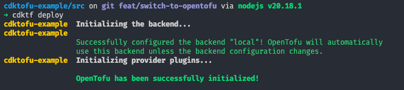

# cdktofu-example

A simple example to switch from Terraform to OpenTofu in a CDKTF stack.

The code within this repository is based on the generated template from `cdktf init` running version 0.20.10 with some minor changes that don't impact the the outcome of the example.

For a change-by-change example, check out [this PR](https://github.com/therealvio/cdktofu-example/pull/1).

## Switching from Terraform to OpenTofu

This guide assumes you have [OpenTofu installed](https://opentofu.org/docs/intro/install/)

### Using the OpenTofu binary

[In most cases](https://github.com/opentofu/opentofu/issues/601) you only need to set the `TERRAFORM_BINARY_NAME` environment variable to the value "tofu". Once this is done, you can verify this by checking the cdktf output. What you should see if OpenTofu in place of Terraform, as depicted in the screenshot below.

</img>

In this example repo, this is set in an .envrc file so tools like [direnv](https://direnv.net/) can reference it.

### Updating Providers

> [!NOTE]
> If your project only uses [the pre-built providers](https://developer.hashicorp.com/terraform/cdktf/concepts/providers#install-pre-built-providers), this isn't applicable to you.

If you generate your own providers within your project is configured in `cdktf.json` that uses the hardcoded `registry.terraform.io` registry, [OpenTofu can fail to resolve the provider](https://github.com/opentofu/opentofu/issues/601#issuecomment-1908955829). To address this, it's a matter of adding the OpenTofu registry as a prefix to your provider in `cdktf.json`. Refer to the example below.

```diff
-"terraformProviders": ["cloudflare/cloudflare@4.49.1"],
+"terraformProviders": ["registry.opentofu.org/cloudflare/cloudflare@4.49.1"],
```
